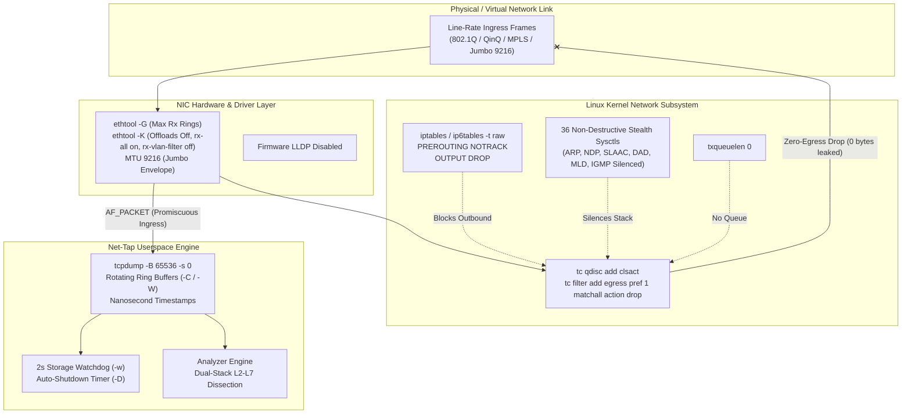
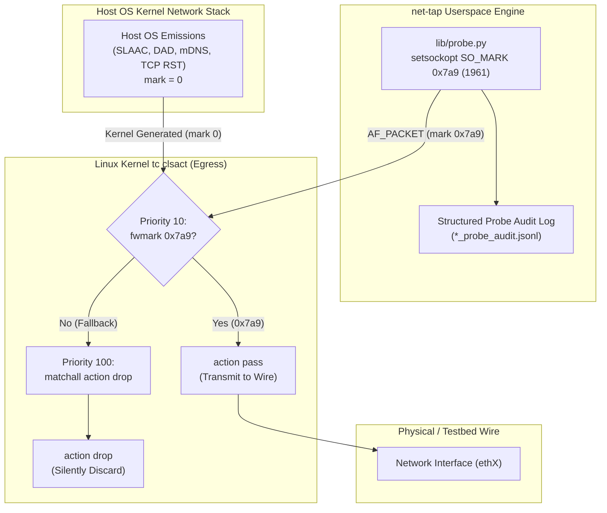
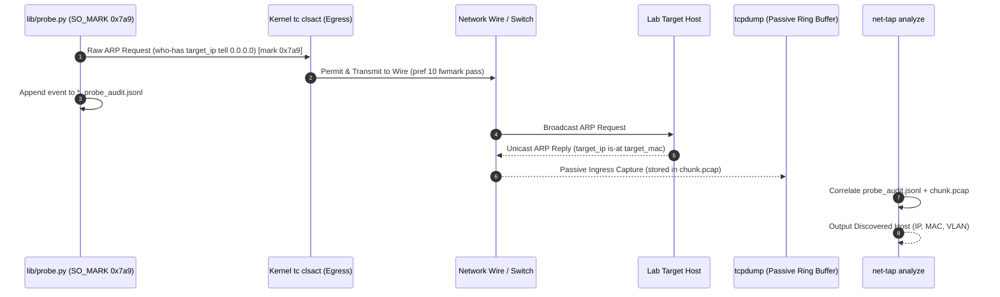
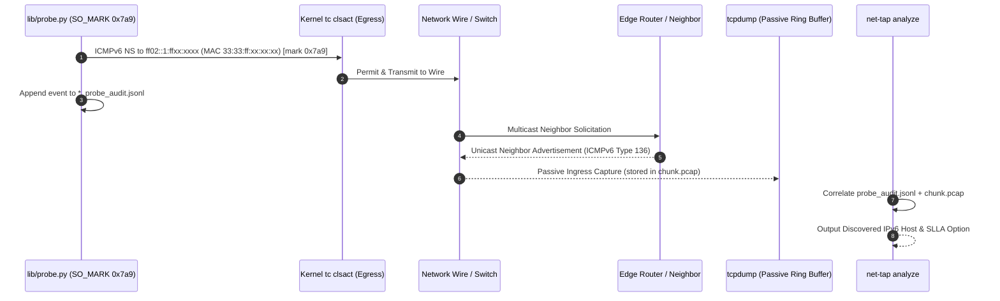
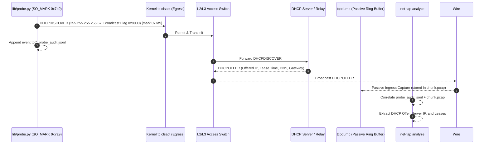
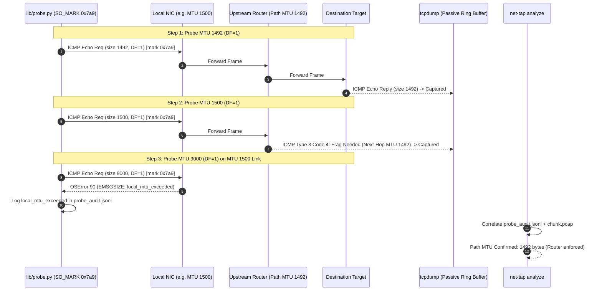
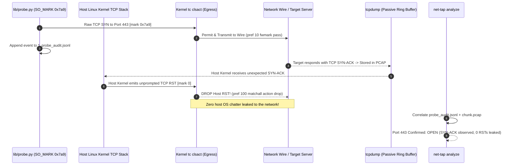
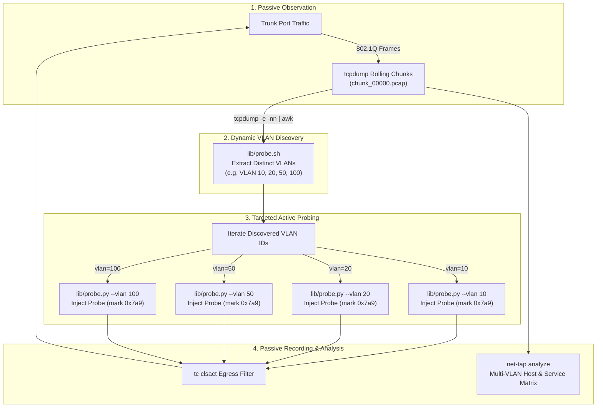

<div align="center">
  
</div>

# Net-Tap: Stealth Tap & Active Telemetry Suite


[](https://github.com/Nementon/net-tap/actions/workflows/ci.yml)


`net-tap` is a network capture and analysis suite for Linux and macOS. Linux provides the complete stealth tap and active telemetry feature set. macOS supports PCAP capture and offline analysis only; it does not enforce egress blocking, support active probes, Linux network namespaces, or Linux NIC tuning.

### Two Operating Modes:
* **Linux passive stealth mode (default)**: Enforces the Linux kernel egress lock (`tc clsact`, Netfilter raw rules, and sysctls) while capturing traffic.
* **Linux active probing mode (`--mode active`)**: Combines capture with audited probes and the Linux selective-egress filter.
* **macOS capture mode**: Captures and rotates PCAP files through `tcpdump`/BPF without reconfiguring the interface. macOS does **not** provide net-tap's zero-egress or selective-egress guarantees; active mode is rejected.

---

## Table of Contents
- [Quick Start](#quick-start)
- [Concept Overview](#concept-overview)
- [Key Features](#key-features)
  - [Hardware & Data Path Stealth](#hardware--data-path-stealth)
  - [Controlled Active Auditing & Selective Egress](#controlled-active-auditing--selective-egress)
  - [High-Performance Capture & Buffer Safety](#high-performance-capture--buffer-safety)
  - [Dual-Stack & Deep Protocol Inspection (DPI)](#dual-stack--deep-protocol-inspection-dpi)
- [Privilege Model & Security](#privilege-model--security)
- [System Requirements & Dependencies](#system-requirements--dependencies)
- [Installation & Uninstallation](#installation--uninstallation)
- [Command Reference](#command-reference)
  - [Subcommands](#subcommands)
  - [Options by Subcommand](#options-by-subcommand)
- [Usage Workflows](#usage-workflows)
  - [1. Single-Interface Passive Tap](#1-single-interface-passive-tap)
  - [2. Dual-Port Optical Tap Aggregation (Tx/Rx)](#2-dual-port-optical-tap-aggregation-txrx)
  - [3. Network Namespace Isolation (VRF / CNI / 5G UPF)](#3-network-namespace-isolation-vrf--cni--5g-upf)
  - [4. Live Interface & Capture Status](#4-live-interface--capture-status)
  - [5. Stop Tapping & Interface Teardown](#5-stop-tapping--interface-teardown)
  - [6. Deep Network Profiling & SIEM JSON Export](#6-deep-network-profiling--siem-json-export)
  - [7. Active Probing & Lab Network Auditing](#7-active-probing--lab-network-auditing)
    - [Architecture & Selective Egress (Watermark 1961)](#architecture--selective-egress-watermark-1961)
    - [Probe 1: ARP Subnet Discovery](#probe-1-arp-subnet-discovery)
    - [Probe 2: IPv6 NDP Discovery (RS & NS)](#probe-2-ipv6-ndp-discovery-rs--ns)
    - [Probe 3: DHCP Discovery (RFC 2131 DHCPv4 & RFC 8415 DHCPv6)](#probe-3-dhcp-discovery-rfc-2131-dhcpv4--rfc-8415-dhcpv6)
    - [Probe 4: Stepped Path MTU Discovery (PMTUD)](#probe-4-stepped-path-mtu-discovery-pmtud)
    - [Probe 5: Lightweight TCP SYN Probing](#probe-5-lightweight-tcp-syn-probing)
    - [Smart Passive-to-Active Discovery (--auto-vlans)](#smart-passive-to-active-discovery---auto-vlans)
- [Sample Analysis Output](#sample-analysis-output)
  - [Human-Readable Terminal Dashboard](#human-readable-terminal-dashboard)
  - [Structured JSON Export Schema](#structured-json-export-schema)
- [Session Artifacts Inventory](#session-artifacts-inventory)
- [Exit Codes Reference](#exit-codes-reference)
- [Operating System & NetworkManager Coexistence](#operating-system--networkmanager-coexistence)
- [Testing & Quality Assurance](#testing--quality-assurance)
- [Troubleshooting](#troubleshooting)
- [Disclaimer & License](#disclaimer--license)

---

## Quick Start

To instantly begin capturing traffic passively with no packet leakage:
```bash
sudo net-tap on -i eth0 -o /data/trace
```
To check capture status:
```bash
net-tap status -i eth0
```
To stop capturing and restore interface defaults:
```bash
sudo net-tap off -i eth0
```
To analyze the captured data:
```bash
net-tap analyze -d /data/trace
```

On macOS, `net-tap on -i en0 -o ./captures` starts a PCAP capture only. It does not block the host from transmitting on that interface.

---

## Concept Overview

| Operational Challenge | How `net-tap` Solves It |
| :--- | :--- |
| **True Zero-Egress Stealth** | Traditional promiscuous mode still permits the host OS to transmit frames (IPv6 SLAAC/DAD, ARP announcements, LLDP/IGMP). These transmissions trip switchport security (MAC limits, 802.1X, BPDU guard) and immediately shut down production links. `net-tap` attaches a kernel `clsact` Traffic Control (`tc`) `matchall` drop filter (priority 1) and Netfilter raw `OUTPUT` drop rules, disables hardware firmware LLDP (`disable-fw-lldp on`), enables `rx-all on` and `rx-vlan-filter off`, sets `txqueuelen 0`, and leaves interfaces administratively `DOWN` on teardown to guarantee **zero outbound bytes** hit the wire, verified via kernel drop counters upon teardown. |
| **Selective Egress & Active Watermarking** | Traditional active scanning tools trigger IDS alarms and alert remote firewalls by leaking unprompted kernel TCP RSTs and OS chatter. In `--mode active`, `net-tap` configures a selective kernel egress filter (`tc filter ... fwmark 0x7a9 pass` followed by `matchall drop`) that strictly permits authorized, watermarked probe frames (IPv4 IP ID `0x07a9`, IPv6 Flow Label `0x007a9`, ICMP Echo ID `1961`, socket mark `0x7a9`) while dropping 100% of host OS background chatter. |
| **Non-Destructive Stealth Sysctls (36 Total)** | Naively setting `disable_ipv6=1` purges static and autoconfigured IPv6 addresses permanently. `net-tap` NEVER sets `disable_ipv6=1`. Instead, it applies 36 non-destructive stealth sysctls across IPv4 and IPv6: IPv6 (`keep_addr_on_down=1`, `addr_gen_mode=1`, `use_tempaddr=0`, `enhanced_dad=0`, `ndisc_notify=0`, `accept_redirects=0`, `router_solicitations=0`, `accept_dad=0`, `dad_transmits=0`, `accept_ra=0`, `autoconf=0`, `mldv1_unsolicited_report_interval=0`, `mldv2_unsolicited_report_interval=0`, `force_mld_version=2`, `drop_unsolicited_na=1`, `accept_untracked_na=0`, `forwarding=0`, `mc_forwarding=0`) and IPv4 (`arp_ignore=8`, `arp_announce=2`, `arp_filter=1`, `arp_notify=0`, `drop_gratuitous_arp=1`, `arp_accept=0`, `proxy_arp=0`, `proxy_arp_pvlan=0`, `send_redirects=0`, `accept_redirects=0`, `secure_redirects=0`, `drop_unicast_in_l2_multicast=1`, `igmpv2_unsolicited_report_interval=0`, `igmpv3_unsolicited_report_interval=0`, `force_igmp_version=3`, `forwarding=0`, `mc_forwarding=0`, `bc_forwarding=0`), faithfully restoring all original values (and interface operstate) on exit. |
| **Connection Tracking (`conntrack`) Protection** | Mirrored line-rate SPAN traffic quickly overwhelms the Netfilter state table, causing kernel memory exhaustion and dropping legitimate host traffic. `net-tap` installs raw `PREROUTING` and `OUTPUT` `NOTRACK` rules in `iptables` and `ip6tables` to bypass connection tracking entirely. |
| **Microburst Loss & Ring-Buffer Protection** | High-speed links easily drop packets at the socket buffer or fill physical drives. `net-tap` dynamically maximizes hardware Rx descriptor rings to the NIC's preset maximum (via `ethtool -g`, falling back to 4096), provisions a 64 MB `libpcap` buffer (`-B 65536`), disables all 6 offloads (`gro`, `lro`, `tso`, `gso`, `rx`, `rxvlan`) to preserve exact frame boundaries, enables nanosecond timestamping (`--time-stamp-precision nano`), and enforces strict rotating chunk limits with active 1-second filesystem threshold monitoring. |
| **Dual-Stack & Telecom Reconnaissance** | Rather than requiring manual Wireshark inspection, `net-tap` parses PCAP headers dynamically to discover VLAN trunks, 802.1ad and legacy (`0x9100`/`0x9200`) QinQ, IPv4 /24 subnets, IPv6 SLAAC prefixes, overlay and carrier tunnels (VXLAN, GTP-U, GTP-C, Geneve, GRE, 6in4, 4in6, SRv6, MPLS), Path MTU Discovery (PMTUD), SCTP signaling, TCP connection handshakes/flags (SYN, SYN-ACK, RST, FIN, PSH, URG, zero-window, retransmissions), carrier routing (IS-IS, BFD, OSPFv2, OSPFv3, BGP), and L4-L7 application metadata (DNS, TLS SNI, SNMP). |
| **Namespace Isolation** | Monitoring virtual routers, Kubernetes CNIs, or mobile 5G UPF nodes requires network namespace awareness. `net-tap` natively supports running isolated captures within Linux Network Namespaces (`ip netns`). |
| **Atomic Locking & Rollback** | Employs dynamic file descriptors, an atomic master serialization lock (`.lock_master`), and dedicated per-interface file locks (`.lock_[<ns>__]<dev>`) supporting arbitrary numbers of concurrent interfaces. If an invalid BPF filter is provided, a bridge master is detected, or `tcpdump` fails to spawn, `net-tap` catches the error and immediately restores the interface to its original pre-tap state without touching unaffected ports. Strict `INT`, `TERM`, `HUP`, and `EXIT` signal traps guarantee that egress filters, firewall rules, and state files are cleaned up even during forced interruptions. |

### Architecture & Data Path



### Session Lifecycle & Atomic State Management

```mermaid
flowchart LR
    Start(["net-tap on"]) --> Lock["Acquire Locks<br/>.lock_master & .lock_dev"]
    Lock --> Preflight["Pre-flight Validation<br/>(Root/Caps, Bridge Enslavement Check, DLT)"]
    Preflight -->|"Pass"| Configure["Apply 36 Stealth Sysctls,<br/>tc matchall Drop, NOTRACK Rules"]
    Preflight -->|"Fail"| Abort["Abort & Rollback<br/>(Untouched IFs Unharmed)"]
    Configure --> Spawn["Spawn tcpdump (-B 65536)<br/>Start Disk Watchdog & Timer"]
    Spawn --> Running[("Active Stealth Capture<br/>Ring Buffer Rotation")]
    Running --> Stop(["net-tap off / Timer"])
    Stop --> Verify["Harvest tcpdump Drop Telemetry<br/>& tc Egress Block Counters"]
    Verify --> Restore["Atomically Restore Sysctls,<br/>Offloads, and Interfaces (Down)"]
    Restore --> Merge["mergecap Chronological Merge<br/>(If Dual-Port sfp0,sfp1)"]
    Merge --> Done(["Clean Exit (State Deleted)"])
```



---

## Key Features

### Hardware & Data Path Stealth
* **Zero-Egress Drop Verification**: Upon shutdown, `net-tap` queries the kernel `tc` filter statistics to report the exact number of outbound packets blocked from leaking onto the monitored segment.
* **Non-Destructive IPv4/IPv6 Sysctls**: Silences ARP broadcasts, IPv6 Router Solicitations, Duplicate Address Detection (DAD), and SLAAC autoconfiguration without flushing assigned interface addresses.
* **Netfilter NOTRACK & Drop Bypassing**: Installs `NOTRACK` and `DROP` targets in the `raw` table for both IPv4 and IPv6 to prevent mirrored traffic from overflowing `nf_conntrack` and block locally generated socket traffic.
* **Elevated Jumbo MTU (up to 9216)**: Automatically elevates the interface MTU up to 9216 bytes (or driver max MTU, minimum 9000) during capture to prevent the kernel from dropping 802.1Q tagged frames, QinQ double-tagged frames, or encapsulated overlay packets.
* **Complete Hardware Offload Neutralization**: Temporarily disables all 6 offloads (`gro`, `lro`, `tso`, `gso`, `rx`, and `rxvlan`) during capture so packet boundaries and timestamps remain unaltered, restoring each offload, PAUSE flow control, and EEE on teardown.
* **Administrative DOWN Teardown Protection**: When unbinding from a tapped link, the interface is restored and left administratively `DOWN` to prevent temporal kernel emission spikes (DAD, MLDv2, ARP) onto live customer links.

### Controlled Active Auditing & Selective Egress
* **Watermark 1961 (0x7a9) Egress Gatekeeping**: In `--mode active`, `tc clsact` allows only probe frames stamped with `SO_MARK 0x7a9`, dropping 100% of host OS emissions (including kernel-generated TCP RST packets on unsolicited SYN-ACK responses).
* **Dual-Stack Active Probing Engine**: Synthesizes raw Layer 2/3 frames without binding host IP addresses: ARP subnet sweeps, intelligent IPv6 NDP scans (CIDR prefix sampling, router solicitations `ff02::2`, all-nodes `ff02::1`, and solicited-node multicast), RFC 2131 DHCP Discover, RFC 8415 DHCPv6 Solicit, stepped envelope PMTU discovery (IPv4 & IPv6), and lightweight TCP SYN probing.
* **Passive-to-Active VLAN Automation (`--auto-vlans`)**: Inspects passive capture buffers on trunk links to dynamically extract active 802.1Q tags and sweeps probes across all discovered VLANs sequentially.
* **Hermetic Audit Correlation**: Emits structured JSONL audit logs with timestamps, sequence numbers, and packet metadata, which `net-tap analyze` cross-references with PCAP ring buffers to correlate live responses.

### High-Performance Capture & Buffer Safety
* **Dynamic Hardware Descriptor Maximization**: Queries NIC preset maximums via `ethtool -g <iface>` and configures the maximum Rx descriptors (falling back to 4096).
* **64 MB Dedicated `libpcap` Buffer**: Configures `tcpdump` with `-B 65536` to absorb microbursts without userspace packet drops.
* **Automated Dual-Port Optical Tap Aggregation**: Ingests bidirectional Tx/Rx feeds from two interfaces simultaneously (e.g., `-i sfp0,sfp1`) and automatically merges them chronologically using `mergecap` on teardown.
* **Auto-Shutdown Duration Timer (`-D`)**: Runs an automated background watchdog that gracefully terminates the capture and restores the NIC after a specified number of seconds.
* **High-Frequency Storage Watchdog & Gzip Compression**: Supports on-the-fly rotated chunk compression (`-z`) and runs a background storage monitor (1s polling, `-w`, default: 85% disk usage or <512MB absolute headroom) that triggers an emergency teardown if disk space is endangered.
* **Syslog Auditing**: Mirrors all tap activation, teardown, watchdog triggers, and error events to `logger` for centralized enterprise log auditing.

### Dual-Stack & Deep Protocol Inspection (DPI)
`net-tap analyze` provides comprehensive passive reconnaissance across all OSI layers:

* **Layer 2 (Data Link)**:
  * 802.1Q VLAN trunking and untagged access port detection.
  * QinQ (802.1ad / 0x88a8) double-tagging discovery.
  * Bit-accurate L2 unicast MAC address extraction (differentiating unicast endpoints from multicast/broadcast traffic via the I/G bit).
  * Port Security risk assessment (flags single-MAC sticky ports vs multi-MAC environments).
  * 802.1X (EAPOL) Network Access Control detection.
* **Layer 3 (Dual-Stack Network)**:
  * Strict IPv4 host extraction, candidate default gateway inference (via ARP replies and `.1` / `.254`), and `/24` subnet mapping.
  * Dual-stack IPv6 unicast host discovery across Global Unicast (`2000::/3`) and Link-Local (`fe80::/10`).
  * IPv6 SLAAC `/64` prefix extraction from ICMPv6 Router Advertisements and router address tracking.
  * Address resolution activity monitoring: IPv4 ARP requests/replies vs IPv6 NDP neighbor/router solicitations.
  * Path MTU Discovery (PMTUD): Detects ICMP Fragmentation Needed and ICMPv6 Packet Too Big notifications.
* **Layer 4 & Encapsulation**:
  * Overlay & Carrier Tunnels: VXLAN (UDP 4789/8472), GTP-U (UDP 2152), GTP-C (UDP 2123), Geneve (UDP 6081), GRE (IP protocol 47), 6in4 / IPv6-in-IPv4 (IP protocol 41), 4in6 / IPv4-in-IPv6 (IP protocol 4), SRv6 Segment Routing (Routing Type 4), MPLS unicast/multicast (`0x8847`/`0x8848`).
  * Carrier Protocols: SCTP telecom signaling (IP protocol 132), BFD / S-BFD (UDP 3784/4784/7784).
  * TCP Connection State Matrix: Tracks SYN, SYN-ACK, RST, FIN, PSH, URG, zero-window probes, and TCP retransmissions.
* **Infrastructure Protocols**:
  * Decodes LLDP (802.1AB), Cisco Discovery Protocol (CDP), Spanning Tree Protocol (STP BPDUs), and First-Hop Redundancy Protocols (VRRP, HSRP).
  * Carrier Routing & Liveness: Decodes IS-IS PDUs and Bidirectional Forwarding Detection (BFD, UDP 3784).
  * Dumps SFP/SFP+ optical diagnostics (optical Rx/Tx power, laser bias, temperature) using `ethtool -m`.
* **Layer 4-7 Reconnaissance (Unlocks with `tshark`)**:
  * Routing Adjacencies: Discovers OSPFv2/OSPFv3 Router IDs and BGP Autonomous Systems (ASNs).
  * Cleartext Credentials: Flags SNMPv1/v2c community strings.
  * Endpoint Hostnames: Parses DHCP Option 12 hostnames.
  * DNS & TLS SNI: Harvests top DNS/mDNS/LLMNR queries and extracts TLS Server Name Indication (SNI) from encrypted client handshakes.

---

## Privilege Model & Security

`net-tap` enforces a strict, least-privilege model:

| Subcommand | Required Privileges | Reason |
| :--- | :--- | :--- |
| `net-tap on` | **Root / Sudo** or **Linux Capabilities** (`CAP_NET_ADMIN` + `CAP_NET_RAW`; requires `CAP_SYS_ADMIN` if `-n <netns>` is used) | Modifies kernel `tc` qdiscs, applies stealth sysctls, inserts Netfilter `NOTRACK` rules, configures ethtool offloads, and opens raw packet sockets. Namespace traversal (`ip netns exec`) additionally requires `CAP_SYS_ADMIN`. |
| `net-tap off` | **Root / Sudo** or **Linux Capabilities** (`CAP_NET_ADMIN` + `CAP_NET_RAW`; requires `CAP_SYS_ADMIN` if `-n <netns>` is used) | Flushes `tc` drop filters, removes Netfilter rules, restores interface sysctls/MTU/promiscuous mode, and terminates background daemons. |
| `net-tap status` | **Unprivileged** (standard user on host; requires `sudo` or `CAP_SYS_ADMIN` for `-n <netns>`) | Live-reads carrier state, ethtool statistics, and capture directory file sizes without requiring elevated privileges. Querying an isolated network namespace via `-n <netns>` requires `CAP_SYS_ADMIN` to execute `ip netns exec`. |
| `net-tap analyze` | **Unprivileged** (standard user) | Reads PCAP files and metadata logs offline; requires standard read permissions on the target directory and disk headroom in `${TMPDIR:-/tmp}` ($\ge \max(50\text{ MB}, 3 \times \text{total PCAP size})$). |
| `net-tap probe` | **Root / Sudo** or **Linux Capabilities** (`CAP_NET_RAW` + `CAP_NET_ADMIN`; requires `CAP_SYS_ADMIN` if `-n <netns>` is used) | Binds raw `AF_PACKET` sockets, applies `SO_MARK 0x7a9`, crafts L2/L3 frames, and transmits active audit probes. |

#### Running with Linux Capabilities (Rootless Tap)
To run `net-tap on` without `sudo`, grant ambient capabilities via `capsh`:
```bash
# Ensure STATE_DIR exists and is writable by your user
sudo mkdir -p /var/run/net-tap && sudo chown $USER:$USER /var/run/net-tap

# Run host tap with ambient CAP_NET_ADMIN and CAP_NET_RAW inherited as non-root user
sudo capsh --user=$USER --inh=cap_net_admin,cap_net_raw --addamb=cap_net_admin,cap_net_raw -- -c "net-tap on -i eth0 -o /data/trace"

# Run namespace tap (additionally requires CAP_SYS_ADMIN for setns)
sudo capsh --user=$USER --inh=cap_net_admin,cap_net_raw,cap_sys_admin --addamb=cap_net_admin,cap_net_raw,cap_sys_admin -- -c "net-tap on -n vrf-blue -i veth-tap -o /data/trace"
```

---

## System Requirements & Dependencies

Linux supports kernels 3.10+ (4.19+ recommended for full `clsact` support). When running inside Docker or Podman, use `--privileged` (or at minimum `--cap-add=NET_ADMIN --cap-add=NET_RAW`) for Linux interface controls and packet capture.

macOS supports capture and PCAP analysis only. Use Bash 4.3 or newer (for example, `brew install bash`) and ensure Homebrew's `bin` directory is on `PATH` so the script uses that Bash instead of the system Bash 3.2. Install `tcpdump`/libpcap tools, Python 3, Scapy, cryptography, and jsonschema for capture, fixture generation, and tests. Interface names and link diagnostics follow macOS conventions (for example, `en0`).

### Required Dependencies (Checked on startup)
* `iproute2` (`ip`, `tc`, `ss`)
* `tcpdump`
* `ethtool`
* `iptables` / `ip6tables` (Netfilter raw table NOTRACK and drop rules)
* POSIX & Linux system utilities: `sysctl`, `dmesg`, `flock`, `gzip`, `mktemp`, `readlink`, `du`, `df`, `awk`, `sed`, `grep`

### Optional Dependencies (Recommended)
* `tshark` (Wireshark CLI): Unlocks L4-L7 Deep Protocol Inspection (DNS, TLS SNI, SNMP, DHCP hostnames, OSPF, BGP).
* `mergecap` (Wireshark suite): Enables automatic chronological merging of Dual-Port optical tap captures (`sfp0,sfp1`).
* `jq`: Recommended for automated validation of `--json` analysis outputs in scripts or CI pipelines.
* `python3-scapy` & `python3-jsonschema`: Required for running synthetic carrier fixture generation and Draft-7 schema validation.

### Quick Package Installation

```bash
# Ubuntu / Debian
sudo apt-get update && sudo apt-get install -y --no-install-recommends \
  tcpdump iproute2 ethtool iptables tshark wireshark-common jq \
  python3-scapy python3-jsonschema

# RHEL / Rocky Linux / Fedora / AlmaLinux
sudo dnf install -y \
  tcpdump iproute iproute-tc ethtool iptables wireshark-cli jq \
  python3-scapy python3-jsonschema
```

```bash
# macOS (Homebrew)
brew install bash shellcheck tcpdump jq
python3 -m venv .venv
source .venv/bin/activate
python3 -m pip install scapy cryptography jsonschema
```

---

## Installation & Uninstallation

Run directly from the repository or install system-wide. The default install location is `/usr/local/sbin` on Linux and Homebrew's prefix (`bin` for the executable) on macOS:

```bash
# Clone the repository
git clone https://github.com/Nementon/net-tap.git
cd net-tap

# Install system-wide
sudo make install

# Uninstall
sudo make uninstall
```

---

## Command Reference

### Subcommands

```bash
net-tap [on|off|status|analyze|probe|list|clean] [options]
```

| Subcommand | Privilege | Description |
| :--- | :--- | :--- |
| `on` | `sudo` | On Linux, provisions passive/active tap mode and rotating capture; on macOS, starts read-only PCAP capture without egress blocking. |
| `off` | `sudo` | Stops capture; Linux also removes `tc` filters and restores the original NIC state. |
| `status` | Standard User | Inspects interface/capture status; detailed hardware counters and link tuning are Linux-only. |
| `analyze` | Standard User | Performs deep protocol inspection and network mapping against a directory of PCAP traces. |
| `probe` | `sudo` | Injects rate-limited discovery probes (ARP, NDP, DHCP, PMTU, TCP SYN) with structured audit trails. |
| `list` | Standard User | Enumerates capture sessions; Linux additionally supports network namespaces and stale-session cleanup. |
| `clean` | `sudo` | Reconciles crashed sessions, terminates orphaned processes, purges stale locks, and detaches dangling filters. |

On macOS, only `on`, `off`, `status`, `analyze`, and `list` are supported, and `on` performs capture without egress protection. `probe`, `clean`, namespaces, timed shutdown, and Linux-specific interface controls are unavailable.

---

### Options by Subcommand

#### Global Options
| Flag | Long Option | Description | Default |
| :--- | :--- | :--- | :--- |
| `-h` | `--help` | Displays the help menu and command usage. | - |

#### Options for `net-tap on`
| Flag | Long Option | Description | Default |
| :--- | :--- | :--- | :--- |
| `-i` | `--interface` | **(Required)** Target interface(s), comma-separated (e.g. `eth1` or `sfp0,sfp1`). | None |
| `-m` | `--mode` | Operational mode: `passive` (strict zero-egress stealth) or `active` (permits explicitly marked audit probes via `net-tap probe` while continuing to drop unsolicited OS emissions). | `passive` |
| `-o` | `--output-dir` | Target directory for PCAP traces and optical/link logs. | `./captures` |
| `-t` | `--type` | Hardware type: `ethernet` or `sfp`. | `ethernet` |
| `-s` | `--speed` | Force link speed in Mbps for SFP transceivers (e.g. `1000`, `10000`). | Auto |
| `-n` | `--netns` | Target Linux network namespace (`ip netns`). | Host namespace |
| `-f` | `--filter` | BPF capture filter (e.g. `"tcp port 80"` or `"vlan or arp"`). Automatically expanded to match inside 802.1Q VLAN, QinQ (802.1ad), and MPLS encapsulated frames unless explicitly specified. Validated offline against Ethernet DLT before activation. | None (capture all) |
| `-C` | `--rotate-size` | Maximum file size per rotating PCAP chunk in MB. | `100` |
| `-W` | `--rotate-count`| Maximum number of rotating PCAP files to retain. | `10` |
| `-z` | `--gzip` | Enable background gzip compression for rotated PCAP chunks. | Disabled |
| `-w` | `--watchdog-threshold` | Storage partition utilization % threshold to trigger emergency auto-stop. | `85` |
| `-D` | `--duration` | Auto-shutdown timer in seconds; tears down capture when timer expires. | Disabled |

#### Options for `net-tap off`
| Flag | Long Option | Description | Default |
| :--- | :--- | :--- | :--- |
| `-i` | `--interface` | **(Required)** Target interface(s), comma-separated (must match interfaces provided to `on`). | None |
| `-n` | `--netns` | Target Linux network namespace (auto-discovered from tap state if omitted). | Auto |

#### Options for `net-tap status`
| Flag | Long Option | Description | Default |
| :--- | :--- | :--- | :--- |
| `-i` | `--interface` | **(Required)** Target network interface(s), comma-separated. | None |
| `-n` | `--netns` | Target Linux network namespace (auto-discovered from active tap state if omitted; requires `sudo` when targeting isolated netns). | Auto (Host default) |

#### Options for `net-tap probe`
| Flag | Long Option | Description | Default |
| :--- | :--- | :--- | :--- |
| `-i` | `--interface` | **(Required)** Target single network interface (must have active session with `--mode active`). | None |
| `-n` | `--netns` | Target Linux network namespace (auto-discovered if omitted). | Host namespace |
| - | `--arp-scan` | Scan IPv4 subnet or host via ARP requests (e.g., `--arp-scan 192.168.1.0/24`). | None |
| - | `--ndp-scan` | Scan IPv6 prefix, host, all-routers (`ff02::2`), or all-nodes (`ff02::1`) via ICMPv6 NS/RS/Echo. | `ff02::2` |
| - | `--dhcp-discover`| Broadcast RFC 2131 DHCP Discover (IPv4) to audit DHCP servers. | None |
| - | `--dhcp-discover6`| Transmit RFC 8415 DHCPv6 Solicit (IPv6 UDP 546->547) to audit DHCPv6 servers. | None |
| - | `--icmp-pmtu` | Probe Path MTU using stepped DF-bit Echo requests (IPv4: 1500-9000B, IPv6: 1280-9000B). | None |
| - | `--tcp-syn` | Probe TCP port availability using single SYN packets (IPv4 or IPv6). | None |
| `-p` | `--ports` | Target TCP port list for `--tcp-syn` (e.g., `22,80,443`). | `22,80,443` |
| - | `--vlan` | Inject probes tagged with IEEE 802.1Q VLAN ID(s) (single `100`, list `10,20`, or range `10-20`). | Untagged |
| - | `--qinq` | Inject probes double-tagged with 802.1ad QinQ as `s_tag,c_tag` (e.g., `100,200`). | None |
| - | `--auto-vlans` | Automatically sweep probes across all active 802.1Q VLAN tags passively observed in capture ring buffer. | Disabled |
| - | `--rate` | Maximum probe transmission rate in packets per second. | `50` |
| - | `--timeout` | Maximum probe duration timeout in seconds. | `5` |
| - | `--audit-id` | Custom audit identifier for probe session correlation in JSONL log. | Auto |

#### Options for `net-tap analyze`
| Flag | Long Option | Description | Default |
| :--- | :--- | :--- | :--- |
| `-d` | `--dir` | Directory containing PCAP traces (`*.pcap`, `*.pcap.gz`) and metadata logs. | `./captures` |
| `-j` | `--json` | Output analysis results as an RFC 8259 structured JSON document. | Disabled (Human-readable) |

#### Options for `net-tap list`
| Flag | Long Option | Description | Default |
| :--- | :--- | :--- | :--- |
| `-i` | `--interface` | Filter sessions by network interface. | All interfaces |
| `-n` | `--netns` | Filter sessions by network namespace. | All namespaces |
| `-j` | `--json` | Output session inventory as a structured JSON array. | Disabled (Human-readable) |

#### Options for `net-tap clean`
| Flag | Long Option | Description | Default |
| :--- | :--- | :--- | :--- |
| `-i` | `--interface` | Clean specific interface session only. | All sessions |
| `-n` | `--netns` | Target specific network namespace for cleanup. | All namespaces |

#### Environment Variables
| Variable | Description | Default |
| :--- | :--- | :--- |
| `STATE_DIR` | Directory for active session state files and per-interface process locks. | `/var/run/net-tap` |
| `NET_TAP_LIB_DIR` | Custom directory containing `core.sh`, `orchestration.sh`, and `analyzer.sh`. | `/usr/local/lib/net-tap` or `../lib` |
| `TMPDIR` | Custom temporary directory for analyzer header caching and parsing. | `/tmp` |
| `COMPRESS_PCAPS` | When set to `1`, forces gzip compression on rotated PCAP chunks (`-z`). | `0` |
| `JSON_OUT` | When set to `1`, forces `analyze` to emit JSON output (`--json`). | `0` |
| `BPF_FILTER` | Default BPF filter applied to captures if `-f` is omitted. | None |

---

## Usage Workflows

### 1. Single-Interface Passive Tap
Provision a physical copper interface (`eth1`) into a silent, zero-egress tap and store rotating traces in `/data/trace`:

```bash
# Start tapping
sudo net-tap on -i eth1 -o /data/trace

# Verify zero outbound leaks and interface status
net-tap status -i eth1

# Stop tapping and restore interface
sudo net-tap off -i eth1
```

---

### 2. Dual-Port Optical Tap Aggregation (Tx/Rx)
When tapping a full-duplex fiber link with an optical splitter tap, transmit (Tx) and receive (Rx) directions arrive on separate physical SFP ports. `net-tap` provisions both interfaces simultaneously, applies zero-egress filters to both, and merges the PCAPs into a single chronological trace (`*_merged_trace.pcap`) upon teardown:

```bash
# Start dual-port capture with gzip compression and 2-hour auto-shutdown
sudo net-tap on -i sfp0,sfp1 -t sfp -s 10000 -o /data/optical_tap -z -D 7200

# Stop capture and merge traces
sudo net-tap off -i sfp0,sfp1
```

---

### 3. Network Namespace Isolation (VRF / CNI / 5G UPF)
Perform non-disruptive packet captures inside a dedicated Linux network namespace (e.g. Kubernetes CNI namespace or carrier VRF):

```bash
# Start capture inside namespace 'vrf-blue' with a BPF filter
sudo net-tap on -n vrf-blue -i veth-tap -f "ip or ip6 or arp" -o /data/vrf_trace

# Inspect status inside namespace (requires sudo to access namespace)
sudo net-tap status -n vrf-blue -i veth-tap

# Teardown tap in namespace
sudo net-tap off -n vrf-blue -i veth-tap
```

---

### 4. Live Interface & Capture Status
Inspect physical link state, negotiation speed, hardware drop statistics, and capture file sizes without root privileges:

```bash
net-tap status -i eth1
```

```text
$ net-tap status -i eth1
Port Status for eth1:
  Physical Link : ACTIVE (10000Mb/s, Full, state: up)
  NIC Counters  : rx_dropped: 0, rx_missed_errors: 0

Active Tap Engine Session:
  Session Started   : 2026-10-04_14-30-00
  tcpdump Status    : RUNNING (PIDs: 12345)
  Capture Files     : 4 files (4 files, 382M total)
```

---

### 5. Stop Tapping & Interface Teardown
Gracefully stops `tcpdump`, flushes ring buffers, verifies zero-egress packet drops, restores sysctls and offloads, and cleans up state:

```bash
sudo net-tap off -i eth1
```

```text
$ sudo net-tap off -i eth1
[INFO] Tearing down background capture processes...
[OK] tcpdump flushed and closed cleanly.
[OK] Promiscuous mode, ARP, MTU, offloads, and IPv4/IPv6 kernel stack restored.

======================================================================
          CAPTURE STOPPED & INTERFACE RETURNED TO DEFAULT
======================================================================
Interfaces            : eth1
PCAP Files            : 4 file(s)
Total Disk Captured   : 382M
Egress Drops Blocked  : 18 packet(s)
======================================================================
Run deep inspection on this session:
  net-tap analyze -d /data/trace
```

---

### 6. Deep Network Profiling & SIEM JSON Export
Analyze captured traces offline without root privileges:

```bash
# Human-readable terminal report
net-tap analyze -d /data/trace

# Machine-readable JSON export for SIEM (Splunk / Elastic)
net-tap analyze -d /data/trace --json > network_profile.json
```

---

### 7. Active Probing & Lab Network Auditing
When auditing lab switches, edge routers, or testbed segments where active stimulus is required, `net-tap` supports **Controlled Active Probing Mode** (`--mode active`). In this mode:
- All 36 stealth sysctls remain fully engaged.
- Kernel `tc clsact` selective egress guards permit ONLY raw frames explicitly stamped with `SO_MARK 0x7a9` (fwmark 1961), while dropping all unsolicited host OS emissions (SLAAC, DAD, mDNS, etc.).
- Every transmitted packet is rate-limited and logged to a structured `<timestamp>_<iface>_probe_audit.jsonl` audit log.
- Supports raw Layer 2 802.1Q single-tagging (`--vlan`), 802.1ad QinQ double-tagging (`--qinq`), and smart `--auto-vlans` sweeping across passively observed tags.

```bash
# 1. Start tap in Active Mode
sudo net-tap on -i eth1 --mode active -o /data/lab_audit

# 2. Run ARP subnet discovery (untagged)
sudo net-tap probe -i eth1 --arp-scan 192.168.1.0/24 --rate 50

# 3. Run ARP discovery on a specific 802.1Q VLAN
sudo net-tap probe -i eth1 --vlan 100 --arp-scan 10.100.1.0/24

# 4. Smart Passive-to-Active Discovery: Automatically sweep across all observed VLANs
sudo net-tap probe -i eth1 --auto-vlans --arp-scan 10.0.0.0/24

# 5. Broadcast DHCP Discover to audit DHCP servers & Option 82 relays
sudo net-tap probe -i eth1 --dhcp-discover

# 6. Measure Path MTU using stepped DF-bit ICMP Echo requests
sudo net-tap probe -i eth1 --icmp-pmtu 192.168.1.1

# 7. Check specific TCP services with light SYN probes
sudo net-tap probe -i eth1 --tcp-syn 192.168.1.1 -p 22,80,443,8080

# 8. Stop capture and correlate responses
sudo net-tap off -i eth1
net-tap analyze -d /data/lab_audit
```

#### Architecture & Selective Egress (Watermark 1961)

Standard network auditing tools run over native kernel network stacks, inadvertently emitting OS background chatter (IPv6 SLAAC / Router Solicitations, Duplicate Address Detection, mDNS, IGMP membership reports, and TCP RSTs to unsolicited packets). In stealth network tapping, such emissions instantly trigger switchport security violations (MAC-limiting port shutdowns, 802.1X quarantine, or BPDU guard).

`net-tap` solves this with a **Dual-Priority Kernel Egress Filter** combined with userspace raw socket marking (`SO_MARK`):

1. **Why Watermark 1961 (`0x7a9`)?**
   - **Mnemonic Value**: Decimal `1961` translates to hexadecimal `0x7a9`. In leetspeak / hex representation: `7` = **T**, `a` = **A**, `9` = **P** (`TAP`).
   - **Collision Immunity**: Linux systems frequently reserve low marks (e.g. `1` to `100` used by `iproute2` policy routing tables), intermediate marks (e.g. `51820` for WireGuard, `0xffff` for Docker bridges), or high bitmasks (e.g. `0x10000+` used by Kubernetes CNI plugins like Cilium and Calico). Fwmark `0x7a9` (1961) cleanly avoids these reserved ranges while fitting securely within a 32-bit `skb->mark`.
2. **Selective Egress Mechanism**:
   - High Priority (`pref 10`): Matches packets with `handle 0x7a9 fw` and executes `action pass`.
   - Low Priority (`pref 100`): Matches all remaining egress packets with `matchall` and executes `action drop`.
   - Result: Only [`lib/probe.py`](lib/probe.py), which sets `SO_MARK = 0x7a9` on its raw `AF_PACKET` socket, can egress. Any packet generated by the host kernel (including TCP RSTs or ICMP errors) has `skb->mark == 0` and is discarded by `tc` before reaching the wire.
3. **Structured Audit Trail**:
   - Every transmitted frame is tracked and logged in real-time to `<timestamp>_<iface>_probe_audit.jsonl` with microsecond precision, target IP/port, VLAN tags, and probe UUID. This ensures 100% forensic traceability and post-run correlation.



---

#### Probe 1: ARP Subnet Discovery

The `--arp-scan <cidr>` probe actively discovers live IPv4 hosts on an untagged network, 802.1Q VLAN, or 802.1ad QinQ trunk without assigning an IP address to the probing interface.

**Implementation Details:**
- **Packet Crafting**: [`lib/probe.py`](lib/probe.py) synthesizes raw Ethernet frames (`Ether(dst="ff:ff:ff:ff:ff:ff") / ARP(op="who-has", pdst=ip)`) with the sender IP set to `0.0.0.0` (or user override) and sender MAC set to the interface hardware MAC (or spoofed MAC).
- **VLAN Tagging**: When `--vlan <spec>` (single ID `100`, list `10,20`, or range `10-20`) or `--qinq <outer>,<inner>` is specified, Scapy prepends `Dot1Q` headers directly in user space without requiring kernel VLAN sub-interfaces (`eth1.100`).
- **Response Handling**: The prober transmits frames at the specified `--rate` (default: 100 pps). Incoming ARP replies (`op="is-at"`) are captured passively by the background `tcpdump` process into the rotating PCAP ring buffer.
- **Offline Correlation**: During `net-tap analyze`, [`lib/analyzer.sh`](lib/analyzer.sh) cross-references the probe audit log with the PCAP ring buffer to extract host IP, responding MAC, and correlated VLAN tag.



---

#### Probe 2: IPv6 NDP Discovery (RS & NS)

The `--ndp-scan <cidr>` probe discovers IPv6 neighbors and routers across local segments and VLANs while strictly bypassing the host OS IPv6 stack (preventing local address binding or SLAAC auto-configuration).

**Implementation Details:**
- **Router Solicitation (RS)**: Broadcasts ICMPv6 Type 133 Router Solicitations to the All-Routers multicast address (`ff02::2`) and multicast MAC `33:33:00:00:00:02`.
- **Neighbor Solicitation (NS)**: Synthesizes ICMPv6 Type 135 Neighbor Solicitations. For each target IPv6 address, it computes the Solicited-Node Multicast address (`ff02::1:ffxx:xxxx`) and destination multicast MAC (`33:33:ff:xx:xx:xx`).
- **Tag Encapsulation**: Emits tagged frames (`Ether / Dot1Q / IPv6 / ICMPv6`) directly through the raw packet socket.
- **Passive Telemetry**: Captured Router Advertisements (RA, Type 134) and Neighbor Advertisements (NA, Type 136) are ingested by [`lib/analyzer.sh`](lib/analyzer.sh) to reveal default gateways, on-link prefixes, autonomous flags, and active IPv6 host MACs.



---

#### Probe 3: DHCP Discovery (RFC 2131 DHCPv4 & RFC 8415 DHCPv6)

The `--dhcp-discover` (IPv4) and `--dhcp-discover6` (IPv6) probes audit dynamic addressing infrastructure, discover active or rogue DHCP servers, and validate pool allocations.

**Implementation Details:**
- **IPv4 DHCPDISCOVER (`--dhcp-discover`)**: Synthesizes an RFC 2131 compliant `DHCPDISCOVER` packet:
  - Source IP: `0.0.0.0`, Destination IP: `255.255.255.255` (UDP 68 -> 67), IPv4 IP ID watermark `0x07a9`.
  - Broadcast Flag: Explicitly set (`flags=0x8000`) to instruct DHCP relays and servers to broadcast responses, ensuring receipt without an assigned IP.
  - Options: Includes Client Hardware MAC, Parameter Request List (Subnet Mask, Router, DNS, Domain, NTP), and unique Transaction ID (`xid`).
- **IPv6 DHCPv6 Solicit (`--dhcp-discover6`)**: Synthesizes an RFC 8415 compliant DHCPv6 Solicit packet:
  - Source IP: Link-Local (`fe80::...`), Destination IP: All_DHCP_Relay_Agents_and_Servers (`ff02::1:2`, UDP 546 -> 547), IPv6 Flow Label watermark `0x007a9`.
  - Destination Multicast MAC: `33:33:00:01:00:02`.
  - Options: Client Identifier (DUID-LL based on hardware MAC), Identity Association for Non-temporary Addresses (IA_NA), Identity Association for Prefix Delegation (IA_PD), and Rapid Commit option.
- **Passive Ingress Correlation**: Ingress DHCP Offer/ACK and DHCPv6 Advertise/Reply packets are captured passively by `tcpdump` into the PCAP ring buffer and extracted by [`lib/analyzer.sh`](lib/analyzer.sh).



---

#### Probe 4: Stepped Path MTU Discovery (PMTUD)

The `--icmp-pmtu <target>` probe diagnoses MTU black holes, baby jumbo frame handling, and tunnel encapsulation overhead (VXLAN, GRE, MPLS) across the path.

**Implementation Details:**
- **Dual-Stack Stepped Envelope Probing**: Transmits ICMP Echo Requests (with IPv4 **Don't Fragment (DF)** bit set, or standard IPv6 Echo Requests) across standard network MTU thresholds:
  - **IPv4 Stepped Envelope**: `1500` (Standard Ethernet), `2000` (Routed MTU), `4000` (Intermediate Jumbo), and `9000` (Standard Jumbo Frame MTU).
  - **IPv6 Stepped Envelope**: `1280` (RFC 8200 IPv6 Minimum Link MTU), `1420` (IPv6-in-IPv4 / WireGuard / Overlay Tunnel MTU), `1500` (Standard Ethernet), `2000`, `4000`, and `9000` (Jumbo Frame MTU).
- **Local MTU Exceeded Handling (`EMSGSIZE`)**: When attempting to inject a 9000-byte frame onto an interface configured with MTU 1500, the Linux kernel raw socket returns `OSError: [Errno 90] Message too long` (`EMSGSIZE`). [`lib/probe.py`](lib/probe.py) catches `EMSGSIZE` gracefully, logging status `local_mtu_exceeded` in the audit trail without terminating execution.
- **Next-Hop MTU Determination**: If an upstream router cannot forward a packet due to an MTU constraint and the DF bit is set, it drops the packet and returns an **ICMP Type 3 Code 4** (*Destination Unreachable: Fragmentation Needed and DF set*), indicating the exact Next-Hop MTU. If no reply is received, an MTU black hole is detected.



---

#### Probe 5: Lightweight TCP SYN Probing

The `--tcp-syn <target> -p <ports>` probe audits critical infrastructure services (SSH, HTTP, HTTPS, BGP, SNMP) without establishing a full TCP connection and without leaking host-generated TCP RST packets.

**Implementation Details:**
- **The "Host RST Hazard" in Traditional Raw Scanners**: In standard Linux scanning (e.g. raw Scapy or custom scripts), sending a raw `TCP SYN` causes the remote target to reply with a `TCP SYN-ACK`. Because the host OS kernel never tracked the outbound connection in its TCP socket table, the Linux kernel interprets the incoming `SYN-ACK` as an unsolicited connection attempt and automatically transmits a `TCP RST`. This unsolicited host RST breaks the audit, alerts firewalls/IDS, and may trigger automated IP blocking.
- **The `net-tap` Stealth Advantage**: In `net-tap`, all kernel-generated egress packets have `skb->mark == 0`. When the kernel TCP stack emits an unprompted `TCP RST`, the packet hits the `tc clsact` filter at `pref 100 matchall action drop` and is instantly discarded! Only the intentional raw SYN (marked with `0x7a9`) reached the target.
- **Port State Analysis**:
  - `SYN-ACK` captured $\to$ **Open** (target accepted connection).
  - `RST` captured $\to$ **Closed** (target port rejected connection).
  - `ICMP Destination Unreachable` (Type 3 Code 1/2/3/9/10/13) or No Response $\to$ **Filtered** (firewall drop or silent stealth host).



---

#### Smart Passive-to-Active Discovery (`--auto-vlans`)

When connecting to an 802.1Q trunk port with dozens or hundreds of VLANs, manual enumeration is tedious and error-prone. The `--auto-vlans` flag transforms passive telemetry into targeted active auditing.

**Implementation Details:**
1. **Passive Chunk Inspection**: When `--auto-vlans` is passed to `net-tap probe`, [`lib/probe.sh`](lib/probe.sh) dynamically reads the captured PCAP files in the active session directory using `tcpdump` and `awk`.
2. **VLAN Set Extraction**: Unique 802.1Q tags observed across ingress broadcast, multicast, or unicast frames are extracted, sorted, and validated.
3. **Sequential Execution**: The probe engine iterates through each discovered VLAN ID, tagging outgoing frames with `Dot1Q(vlan=vid)` and stamping them with fwmark `0x7a9`.
4. **Unified Correlation**: Results across all VLANs are logged with their corresponding `vlan_tag` field in `probe_audit.jsonl`, enabling `net-tap analyze` to present a unified multi-VLAN topology map.



---

## Sample Analysis Output

### Human-Readable Terminal Dashboard

```text
$ net-tap analyze -d /data/trace
[INFO] Analyzing 1 capture file(s) in /data/trace...
[INFO] Caching packet headers to tmpfs for high-speed analysis...
[INFO] Caching Deep Protocol Inspection data (L4-L7)...

======================================================================
 [1] PHYSICAL LAYER & CARRIER STABILITY ANALYSIS
======================================================================
SFP Optical Diagnostics Detected:
  Receiver signal average optical power: -4.51 dBm
  Laser output power: -2.33 dBm
  Temperature: 34.12 degrees C
  Physical link remained stable without carrier drops during monitoring.

======================================================================
 [2] LAYER 2: ETHERNET & VLAN SEGMENTATION
======================================================================
Discovered IEEE 802.1Q VLAN Tags:
  [FOUND] QinQ Double-Tagging (802.1ad): 4 nested VLAN frame(s) observed.
  Trunk Port Detected! Active 802.1Q VLAN IDs observed:
    -> VLAN ID: 10
    -> VLAN ID: 20
    -> VLAN ID: 99

Active Unicast MAC Addresses Observed:
  Found 4 unique Layer 2 host MAC address(es):
    00:11:22:33:44:55
    00:1a:2b:3c:4d:5e
    02:00:00:00:00:01
    02:00:00:00:00:02

======================================================================
 [3] LAYER 3: DUAL-STACK IPv4 & IPv6 ALLOCATIONS
======================================================================
Inferred IPv4 Network Subnets (/24 approximations):
  Subnet: 10.0.10.0/24 (4 active host IP(s) detected)
  Subnet: 10.0.20.0/24 (8 active host IP(s) detected)

Identified IPv4 Host IPs:
    10.0.10.1
    10.0.10.50
    10.0.20.1
    10.0.20.100

Inferred Default Gateway Candidates:
  Likely Gateway: 10.0.10.1
  Likely Gateway: 10.0.20.1

Discovered IPv6 Host Addresses:
  Found 3 active IPv6 host address(es):
    -> 2001:db8:beef::10
    -> 2001:db8:beef::100
    -> fe80::1
  Classification: Global Unicast (GUA): 2 | Unique Local (ULA): 0 | Link-Local: 1

Inferred IPv6 Subnets (/64 approximations):
  Subnet: 2001:db8:beef::/64 (2 active host IP(s) detected)

IPv6 Router Advertisements & SLAAC Prefixes:
  [FOUND] Advertised SLAAC Subnet Prefixes (/64):
    -> Prefix: 2001:db8:beef::/64
  [FOUND] IPv6 Router Advertisements originating from:
    -> Router: fe80::1

Address Resolution Protocol Activity:
  IPv4 ARP Resolution Frames  : 14
  IPv6 NDP Resolution Frames  : 6 (NS: 2, NA: 2, RS: 0, RA: 1, Redirect: 1)

Network Tunnels & Overlay Encapsulation:
  [ALERT] VXLAN Overlay Tunnels: 12 UDP/4789 packet(s).
  [ALERT] GTP-U Mobile User Plane Tunnels: 2 UDP/2152 packet(s).
  [ALERT] GTP-C Mobile Control Plane Tunnels: 1 UDP/2123 packet(s).
  [ALERT] Geneve Overlay Tunnels: 1 UDP/6081 packet(s).
  [ALERT] GRE Tunnels Detected: 1 IP/47 encapsulation packet(s).
  [ALERT] MPLS Transport Labeling: 2 frame(s) observed.
  [ALERT] SCTP Telecom Signaling: 1 IP/132 carrier packet(s).
  [FOUND] IS-IS Routing Protocol: 1 frame(s) observed.
  [FOUND] BFD Fault Detection: 1 frame(s) observed.
  [WARN] Path MTU Discovery (PTB/Frag Needed): 1 frame(s) observed.

TCP Connection State Matrix:
  SYN Requests : 42 | SYN-ACK Handshakes : 40 | RST Aborts : 2 | FIN Closes : 38
  PSH Flags    : 40 | URG Flags : 0 | Zero-Window Events : 2 | Retransmissions : 0

======================================================================
 [4] INFRASTRUCTURE PROTOCOLS (LLDP, CDP, STP, FHRP)
======================================================================
  [FOUND] LLDP (Link Layer Discovery Protocol): 4 frames observed.
    LLDP, name core-sw-01.corp, length 128
  [FOUND] CDP (Cisco Discovery Protocol): 2 frames observed.
  [FOUND] Spanning Tree Protocol (STP): 28 BPDUs observed.
  [FOUND] VRRP (Virtual Router Redundancy): 2 frames observed.
  [FOUND] Cisco HSRP: 1 frames observed.

======================================================================
 [5] LAYER 2 SECURITY & ADMISSION CONTROL PROFILE
======================================================================
  [PASS] IEEE 802.1X (EAPOL): No EAPOL identity requests observed.
  DHCP Infrastructure Active: 6 DHCP broadcast/relay packets observed.

Port Security / MAC Limit Risk Assessment:
  [LOW RISK] Multiple MAC addresses (4) observed. The switchport is
  not restricted to a single sticky MAC address.

======================================================================
 [6] DEEP PROTOCOL INSPECTION (L4-L7 via TSHARK)
======================================================================
[ALERT] SNMP Cleartext Community Strings Detected:
  -> public

OSPF/OSPFv3 Neighbors (Router IDs):
  -> 10.255.255.1

BGP Autonomous Systems (ASNs):
  -> AS65001

DHCP Hostnames Detected:
  -> srv-dc01

Top DNS / mDNS / LLMNR Queries:
  -> srv-dc01.corp.local
  -> api.internal.network

Top TLS SNI Destinations:
  -> login.microsoftonline.com
  -> telemetry.internal.network

======================================================================
 [7] ACTIVE AUDIT & TARGET PROBING CORRELATION
======================================================================
  Audit Trail Logs     : 1 audit file(s) found in capture dir
  Probes Transmitted   : 254 packet(s)
  Responses Received   : 4 packet(s)
  VLAN Profiles Tested : untagged, 10, 20

  Discovered Responsive Hosts:
    -> 10.0.10.1 [00:11:22:33:44:55] (VLAN: 10)
    -> 10.0.20.1 [00:1a:2b:3c:4d:5e] (VLAN: 20)
    -> 192.168.1.1 [02:00:00:00:00:01] (VLAN: untagged)

======================================================================
                      ANALYSIS COMPLETE
======================================================================
```

---

### Structured JSON Export Schema

Running `net-tap analyze -d <dir> --json` produces a standardized JSON document:

```json
{
  "vlans": ["10", "20", "99"],
  "qinq_frames": 4,
  "mac_addresses": [
    "00:11:22:33:44:55",
    "00:1a:2b:3c:4d:5e",
    "02:00:00:00:00:01",
    "02:00:00:00:00:02"
  ],
  "ipv4_addresses": [
    "10.0.10.1",
    "10.0.10.50",
    "10.0.20.1",
    "10.0.20.100"
  ],
  "ipv4_gateways": [
    "10.0.10.1",
    "10.0.20.1"
  ],
  "ipv6_addresses": [
    "2001:db8:beef::10",
    "2001:db8:beef::100",
    "fe80::1"
  ],
  "ipv6_prefixes": [
    "2001:db8:beef::/64"
  ],
  "ipv6_routers": [
    "fe80::1"
  ],
  "resolution": {
    "arp_frames": 14,
    "ndp_frames": 6,
    "ndp_details": {
      "neighbor_solicitation": 2,
      "neighbor_advertisement": 2,
      "router_solicitation": 0,
      "router_advertisement": 1,
      "redirect": 1
    }
  },
  "tunnels": {
    "vxlan": 12,
    "gtp_u": 2,
    "gtp_c": 1,
    "geneve": 1,
    "gre": 1,
    "mpls": 2,
    "six_in_four": 0,
    "four_in_six": 0,
    "srv6": 0
  },
  "protocols": {
    "sctp": 1,
    "pmtud": 1,
    "tcp_flags": {
      "syn": 42,
      "syn_ack": 40,
      "rst": 2,
      "fin": 38,
      "psh": 40,
      "urg": 0,
      "zero_window": 2,
      "retransmission": 0
    }
  },
  "infrastructure_frames": {
    "lldp": 4,
    "cdp": 2,
    "stp": 28,
    "vrrp": 2,
    "hsrp": 1,
    "isis": 1,
    "bfd": 1
  },
  "security_frames": {
    "eapol": 0,
    "dhcp": 6
  },
  "dpi": {
    "snmp_community_strings": ["public"],
    "ospf_routers": ["10.255.255.1"],
    "bgp_asns": ["65001"],
    "dhcp_hostnames": ["srv-dc01"],
    "dns_queries": ["srv-dc01.corp.local", "api.internal.network"],
    "tls_sni": ["login.microsoftonline.com", "telemetry.internal.network"]
  },
  "active_audit": {
    "audit_files": ["20261004_143000_eth1_probe_audit.jsonl"],
    "probes_sent": 254,
    "responses_received": 4,
    "vlans_probed": ["untagged", "10", "20"],
    "discovered_hosts": [
      {
        "ip": "10.0.10.1",
        "mac": "00:11:22:33:44:55",
        "vlan": "10"
      },
      {
        "ip": "10.0.20.1",
        "mac": "00:1a:2b:3c:4d:5e",
        "vlan": "20"
      },
      {
        "ip": "192.168.1.1",
        "mac": "02:00:00:00:00:01",
        "vlan": "untagged"
      }
    ]
  }
}
```

---

## Session Artifacts Inventory

Every active capture session creates a predictable hierarchy of state, telemetry, and capture artifacts:

| Path / Pattern | Creator | Purpose / Contents |
| :--- | :--- | :--- |
| `STATE_DIR/net-tap.<iface>.state` | `net-tap on` | Shell key-value state file storing active capture PID, capture directory, ring-buffer parameters, start epoch, and operational mode (`passive` or `active`). |
| `STATE_DIR/net-tap.<iface>.lock` | `net-tap on` | Interface lock file used to serialize operations and prevent conflicting concurrent tap sessions on the same interface. |
| `<dir>/<prefix>_<timestamp>_<iface>_<seq>.pcap` | `tcpdump` | Rolling ring-buffer PCAP chunks formatted according to libpcap/pcap-ng standards. |
| `<dir>/<prefix>_<timestamp>_<iface>_dmesg.log` | Host daemon | Continuous kernel ring buffer diagnostics tracking physical transceiver SFP link-flaps, carrier state changes, and PHY errors (suppressed when running inside network namespaces). |
| `<dir>/<prefix>_<timestamp>_<iface>_metadata.json` | `net-tap off` | Session metadata containing tap duration, kernel packet counters, interface drop statistics, offload states, and applied BPF filters. |
| `<dir>/<prefix>_<timestamp>_<iface>_probe_audit.jsonl` | `lib/probe.py` | Real-time JSON Lines audit trail of every transmitted active probe packet, recording timestamp, audit ID, probe type, sequence number, target, VLAN/QinQ tags, source/destination MAC, and protocol metadata. |
| `<dir>/analysis_report.json` | `net-tap analyze` | RFC 8259 structured JSON document summarizing physical layer health, VLAN segmentation, MACs, dual-stack IP subnets, routing protocols, and active probe correlations. |

---

## Exit Codes Reference

`net-tap` adheres to POSIX standard exit conventions across all subcommands:

| Exit Code | Classification | Meaning / Operational Action |
| :---: | :--- | :--- |
| `0` | **Success** | Subcommand completed normally (e.g. tap armed, tap disarmed cleanly, probe sweep finished, or PCAP analysis completed). |
| `1` | **General Error** | CLI argument validation failure, missing required dependency (`tcpdump`, `tc`, `ethtool`), invalid network interface, insufficient disk space, permission denied, or operational failure. |
| `130` | **Script Interrupted (`SIGINT`)** | Process received a `SIGINT` (e.g., user pressed `Ctrl+C`). Cleanup trap executes automatically to disarm interfaces and release locks. |
| `143` | **Terminated (`SIGTERM`)** | Process was terminated by an external orchestrator or system manager via `SIGTERM`. Handlers safely tear down monitoring and flush ring buffers. |

---

## Operating System & NetworkManager Coexistence

When deploying `net-tap` on production workstations, jump boxes, or bare-metal field laptops, network configuration managers (such as NetworkManager or `systemd-networkd`) often attempt to auto-configure interfaces the moment link carrier is detected.

### Built-in Zero-Egress Protection
Even if NetworkManager or `systemd-networkd` detects the interface coming `UP`, `net-tap`'s multi-layered egress gatekeeper intercepts and suppresses all host emissions:
1. `tc clsact` immediately drops any frame with `skb->mark != 0x7a9`.
2. Netfilter raw table `NOTRACK` and `DROP` rules suppress local connection tracking and drop outbound packets.
3. Disabled kernel autoconfiguration (`accept_ra=0`, `dad_transmits=0`, `router_solicitations=0`) prevents the local kernel from soliciting or binding IPv6 addresses.

### Explicit NetworkManager Unmanaged Configuration (Recommended)
To prevent NetworkManager from logging warnings, repeatedly attempting DHCP queries, or interfering with interface link states, configure the target interface as unmanaged:

**Option 1: Runtime command**
```bash
sudo nmcli dev set eth1 managed no
```

**Option 2: Persistent configuration snippet (`/etc/NetworkManager/conf.d/99-net-tap.conf`)**
```ini
[keyfile]
unmanaged-devices=interface-name:eth1;interface-name:eth2
```
```bash
sudo systemctl reload NetworkManager
```

---

## Testing & Quality Assurance

`net-tap` includes platform-specific test coverage for linting, CLI parsing, synthetic trace analysis, and JSON schema verification:

### 1. Unprivileged Unit & Compliance Tests
Runs ShellCheck (with zero tolerated warnings), tests CLI parameter boundaries, verifies offline PCAP profiling against synthetic carrier traces, and validates JSON output against both formal Draft-7 schemas and `jq` structural assertions:

```bash
make test
```

### 2. Privileged Integration & Network Namespace Suite
On Linux, executes end-to-end operational tests in an ephemeral network namespace (`veth` pairs), asserts zero-egress packet drop counts, validates BPF syntax rejection, and confirms interface state restoration. This target is Linux-only:

```bash
make test-integration
```

### 3. Continuous Integration
On macOS, `make test` runs PCAP analysis and platform-boundary tests; it does not claim to validate zero-egress behavior. CI additionally starts and stops a root-owned capture on loopback, while Linux CI runs the network namespace and egress-filter integration suite.

---

## Troubleshooting

* **AppArmor / SELinux Denials:** Ubuntu's default AppArmor profile for `tcpdump` (`/etc/apparmor.d/usr.bin.tcpdump` or legacy `/etc/apparmor.d/usr.sbin.tcpdump`) restricts writing PCAP files to paths outside `/tmp` or standard system directories. If `tcpdump` fails with `Permission denied` when saving to a custom path:
  ```bash
  # AppArmor (Ubuntu / Debian) - Option 1: Put tcpdump into complain mode
  sudo aa-complain /usr/bin/tcpdump || sudo aa-complain /usr/sbin/tcpdump

  # AppArmor - Option 2: Add your custom capture path to AppArmor local overrides
  echo "/data/trace/** rw," | sudo tee -a /etc/apparmor.d/local/usr.bin.tcpdump /etc/apparmor.d/local/usr.sbin.tcpdump 2>/dev/null || true
  sudo apparmor_parser -r /etc/apparmor.d/usr.bin.tcpdump 2>/dev/null || sudo apparmor_parser -r /etc/apparmor.d/usr.sbin.tcpdump

  # SELinux (RHEL / Rocky / Fedora / AlmaLinux)
  sudo semanage fcontext -a -t var_log_t "/data/trace(/.*)?"
  sudo restorecon -Rv /data/trace
  ```
* **Stale Locks or Orphaned State Files:** If an unexpected host reboot or unhandled SIGKILL leaves lock or state files behind in `/var/run/net-tap`:
  ```bash
  # Clean up all stale session state, lock files, and background daemons
  sudo net-tap clean
  ```
* **Interface in DOWN State:** If `net-tap on` fails because the interface remains physically down:
  - Check physical cabling and transceiver optics: `sudo ethtool <iface>` or `sudo ethtool -m <iface>`
  - Verify that the administrative state can be toggled: `sudo ip link set <iface> up`
  - Ensure the interface is not hard-blocked by an RF switch or firmware switch.
* **Bridge, Bond, or OVS Enslavement Conflicts:** Interfaces enslaved to a Linux bridge (`br0`), Open vSwitch (OVS), or bonding team (`bond0`) cannot be isolated into stealth mode:
  ```bash
  # Detach interface from master bridge or bond prior to tapping
  sudo ip link set <iface> nomaster
  ```
* **Active Probing Requirements (`net-tap probe`):** Active probing requires Python 3 and Scapy. If missing:
  ```bash
  # Debian / Ubuntu
  sudo apt-get install python3 python3-scapy

  # RHEL / Rocky / Fedora
  sudo dnf install python3 python3-scapy
  ```
* **Kernel Socket Buffer Tuning (Microburst Protection):** To absorb high-bandwidth bursts and prevent packet drops before `tcpdump`'s 64MB buffer can ingest them, elevate the kernel's maximum socket receive buffer limits:
  ```bash
  sudo sysctl -w net.core.rmem_max=67108864
  sudo sysctl -w net.core.rmem_default=67108864
  ```
* **Missing `tshark` or `mergecap`:** If Layer 4-7 DPI is skipped or dual-port traces are not automatically merged, install the Wireshark CLI suite:
  ```bash
  # Debian / Ubuntu
  sudo apt-get install tshark wireshark-common

  # RHEL / Rocky / Fedora
  sudo dnf install wireshark-cli
  ```
* **High Dropped Packets on Busy Links:** If `status` reports interface drops, verify that your NIC supports maximum Rx ring buffers (`ethtool -g <iface>`), ensure disk write throughput can sustain line rate (or use ramdisk/tmpfs for `-o`), or filter unneeded packets using a BPF expression (`-f "vlan or arp or port 53"`).

---

## Disclaimer & License

### Disclaimer
`net-tap` is designed for authorized network engineering, diagnostic troubleshooting, and defensive security telemetry. It must only be deployed on network infrastructure where you possess explicit administrative authorization. The authors assume no liability for unauthorized deployment or operational disruption.

### License
This project is released under the **Beer-Ware License** (Revision 42). See the [LICENSE](LICENSE) file for complete details.
